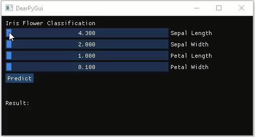

# Python Desktop GUI Application

Model Deployment using Desktop GUI using python can become an options if we want to make a Desktop GUI Application so that user can interact with the application interface such as slider and button.

While there's many option in creating GUI Application like **[TkInter](https://wiki.python.org/moin/TkInter)** which is the Python's de-facto standard GUI (*Graphical User Interface*) package and **[pyQT](https://wiki.python.org/moin/PyQt)** which is one of the most popular Python bindings for the Qt cross-platform C++ framework which developed by [Riverbank Computing Limited](http://www.riverbankcomputing.com/), There's also another alternative to the GUI Development like **[DearPyGUI](https://hoffstadt.github.io/DearPyGui/index.html)** which we want to use in this sample.

## Dear PyGUI
Dear PyGui is an **easy-to-use, flexible, powerful graphical user interface (GUI) framework for Python**. As an extended wrapping of Dear ImGui, Dear PyGui is highly performant. It is written primarily in C/C++ and uses your GPU for renderering. Features include traditional GUI elements to display text, images and various controls, such as buttons, radio buttons, and menus and various methods to create a functional and beautiful layout. Additionally, it offers incredibly dynamic charts, tables, drawings and tools for application development, such as built-in documentation, logging, and debugger.

As a GUI toolkit, it is equally suitable for creating simple user interfaces for wrapping a basic command line interface. It can also be used for science, engineering, games, data science and other applications that require fast and interactive interfaces.

<br>

To install:

```python 
pip install dearpygui
```
To run the application we can simply run

```python
python iris_pygui.py
```

Or, in windows we can make bat file so user can just double click the bat file to run the application
```python
Double click file 'iris_pygui.bat'
```

<p align="center"> 

</p>

<br><br>
___
### Helpful Resources to start using DearPyGUI:

* https://hoffstadt.github.io/DearPyGui/examples.html
* https://hoffstadt.github.io/DearPyGui/tutorial.html